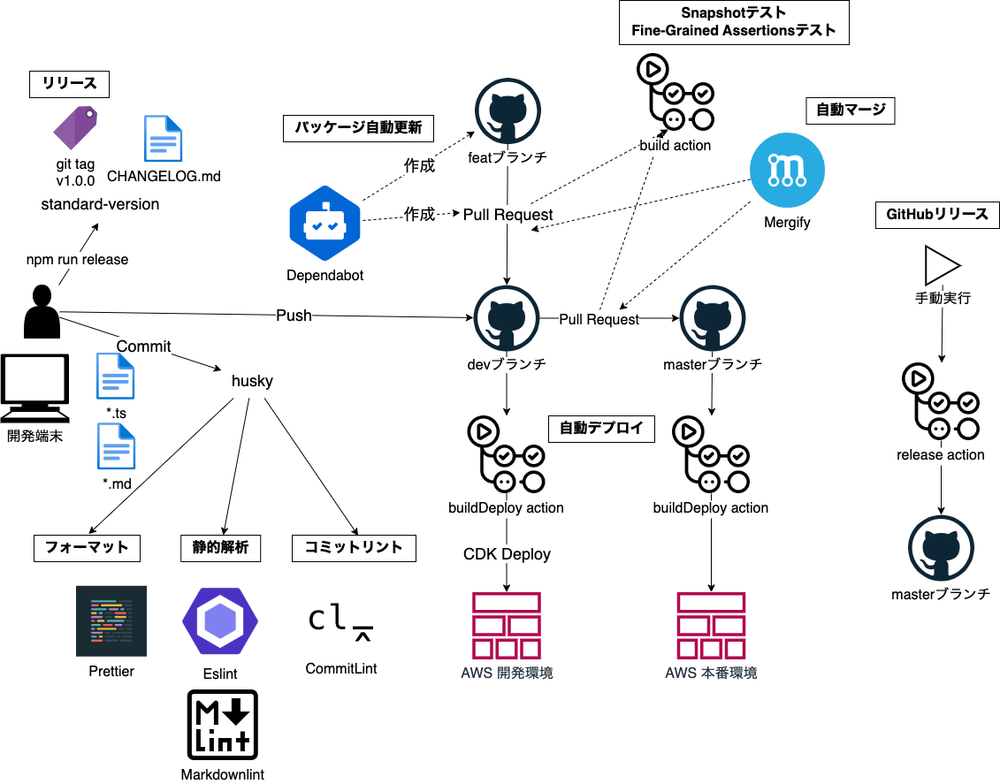
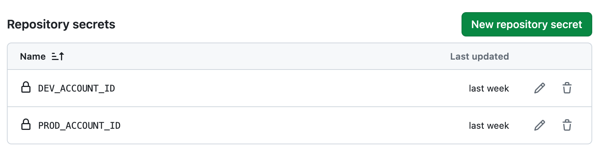

# AWS CDK プロジェクトテンプレート　 <!-- omit in toc -->

このプロジェクトはGitHubリポジトリ管理を想定したAWS CDKプロジェクトのテンプレートです  
静的解析、テスト、GitHub ActionsによるCICDなどを含みます

## 目次 <!-- omit in toc -->

- [構成](#構成)
- [開発環境構築](#開発環境構築)
  - [リポジトリの作成と設定](#リポジトリの作成と設定)
  - [GitHub ActionsでIAM Roleを使ってAWSにアクセスするための設定](#github-actionsでiam-roleを使ってawsにアクセスするための設定)
  - [GitHubの設定でSecretsにアカウントIDを登録](#githubの設定でsecretsにアカウントidを登録)
  - [Github Appsの設定](#github-appsの設定)
  - [パッケージインストール](#パッケージインストール)
  - [デプロイ先AWSアカウントIDを環境変数に登録](#デプロイ先awsアカウントidを環境変数に登録)
- [設定ファイル一覧](#設定ファイル一覧)
- [CICD](#cicd)
  - [静的解析](#静的解析)
  - [ビルドとテスト](#ビルドとテスト)
  - [CDK Deploy](#cdk-deploy)
- [リリース](#リリース)
  - [CHANGELOGの更新とタグの付与](#changelogの更新とタグの付与)
  - [mainブランチへのマージ](#mainブランチへのマージ)
  - [リリース用GitHub Actionの実行](#リリース用github-actionの実行)

## 構成



## 開発環境構築

### リポジトリの作成と設定

任意のリポジトリ名でディレクトリを作成

```bash
mkdir [リポジトリ名]
cd [リポジトリ名]
```

cdk-project-templateのzipをダウンロードして展開  
zipの中身を作成したディレクトリの配下に入れる

https://github.com/kasiopeiya/cdk-project-template/releases/latest/download/slim-template.zip

```bash
~/dev/aws-cdk/hoge $ ls
CHANGELOG.md            bin                     config.ts               lib                     package.json            test
README.md               cdk.json                jest.config.js          package-lock.json       resources               tsconfig.json
```

### GitHub ActionsでIAM Roleを使ってAWSにアクセスするための設定

参考リンクをもとに以下を作成

- IDプロバイダーの作成
- デプロイ用IAM Role作成

参考  
https://qiita.com/yh1224/items/2a8223201b48a5c41e7a  
https://blog.serverworks.co.jp/github-actions-iam-role

### GitHubの設定でSecretsにアカウントIDを登録

- DEV_ACCOUNT_ID  
  開発環境のアカウントID
- PROD_ACCOUNT_ID  
  本番環境のアカウントID



### Github Appsの設定

Set up a planで以下を対象リポジトリに導入する

- Mergify  
  https://github.com/marketplace/mergify

### パッケージインストール

package-lock.jsonがあるディレクトリで以下実行

```bash
npm ci
```

### デプロイ先AWSアカウントIDを環境変数に登録

macの場合

```bash
echo "export DEV_ACCOUNT_ID=***" >> ~/.zshrc
echo "export PROD_ACCOUNT_ID=***" >> ~/.zshrc
source ~/.zshrc
```

## 設定ファイル一覧

| ファイル名                         | 動作タイミング                                      | 内容                                                                                                                                          | リンク                                                                                                                                                           |
| ---------------------------------- | --------------------------------------------------- | --------------------------------------------------------------------------------------------------------------------------------------------- | ---------------------------------------------------------------------------------------------------------------------------------------------------------------- |
| tsconfig.json                      | 開発時、ビルド                                      | Typescript設定ファイル                                                                                                                        | [link](https://www.typescriptlang.org/ja/tsconfig/)                                                                                                              |
| cdk.json                           | 開発時                                              | AWS CDKの設定ファイル                                                                                                                         |                                                                                                                                                                  |
| config.ts                          | 開発時                                              | 独自に作成したAWS CDKコードで使用する<br/>定数設定ファイル                                                                                    |                                                                                                                                                                  |
| .editorconfig                      | 開発時                                              | コードエディタ間でファイルフォーマットを<br/>一貫させるための設定ファイル                                                                     | [link](https://editorconfig.org/)                                                                                                                                |
| .versionrc                         | 開発時                                              | ローカルブランチで動作する<br/>バージョニングツールstandard-version<br/>の設定ファイル                                                        | [link](https://github.com/conventional-changelog/conventional-changelog-config-spec/blob/master/versions/2.2.0/README.md)                                        |
| CHANGELOG.md                       |                                                     | standard-versionによってgit logをもとに<br/>自動生成される変更履歴                                                                            |                                                                                                                                                                  |
| jest.config.js                     | 開発時、ビルド                                      | テストツールjestの設定ファイル                                                                                                                | [link](https://jestjs.io/ja/docs/configuration)                                                                                                                  |
| .vscode/extensions.json            | 開発時                                              | VSCodeのおすすめ拡張機能リスト                                                                                                                | [link](https://code.visualstudio.com/docs/editor/extension-marketplace#_workspace-recommended-extensions)                                                        |
| .vscode/settings.json              | 開発時                                              | VSCodeの設定ファイル                                                                                                                          | [link](https://code.visualstudio.com/docs/getstarted/settings)                                                                                                   |
| .prettierrc.js                     | 開発時、コミット、ビルド                            | コードを自動フォーマットするPrettier<br/>の設定ファイル                                                                                       | [link](https://prettier.io/docs/en/configuration.html)                                                                                                           |
| .prettierignore                    | 開発時、コミット、ビルド                            | Prettierの対象外とするファイルを指定する                                                                                                      | [link](https://prettier.io/docs/en/ignore.html)                                                                                                                  |
| .eslintrc.js                       | コミット、ビルド                                    | Typescriptコードの静的解析に利用するESLint<br/>の設定ファイル                                                                                 | [link](https://eslint.org/docs/latest/use/configure/configuration-files)                                                                                         |
| .markdownlint-cli2.jsonc           | コミット、ビルド                                    | Markdownファイルの静的解析に利用する<br/>markdownlint-cli2の設定ファイル                                                                      | [link](https://github.com/DavidAnson/markdownlint-cli2)                                                                                                          |
| .depcheckrc.yml                    | ビルド                                              | 未使用のパッケージやpackage.jsonの記載確認<br/>するdepcheckの設定ファイル                                                                     | [link](https://www.npmjs.com/package/depcheck)                                                                                                                   |
| .github/.mergify.yml               | GitHub上でプルリク作成時                            | 条件に基づいてプルリクの自動マージを行う<br/>GitHub AppsのMergiftの設定ファイル                                                               | [link](https://docs.mergify.com/configuration/file-format/)                                                                                                      |
| .github/PULL_REQUEST_TEMPLATE.md   | GitHub上でプルリク作成時                            | プルリクのテンプレートファイル<br/>自動で適用される                                                                                           | [link](https://docs.github.com/ja/communities/using-templates-to-encourage-useful-issues-and-pull-requests/creating-a-pull-request-template-for-your-repository) |
| .github/dependabot.yml             | GitHub上、スケジュール実行                          | パッケージの更新を自動で確認し、<br/>アラートをあげたり、プルリクを作成する<br/>Dependabotの設定ファイル<br/>設定ファイルを置くだけで動作する | [link](https://docs.github.com/ja/code-security/dependabot/dependabot-version-updates/configuration-options-for-the-dependabot.yml-file)                         |
| .github/workflows/build.yml        | リモートブランチpush時<br/>GitHub上でプルリク作成時 | GitHub Actionsのワークフロー<br/>ビルドを行う                                                                                                 |                                                                                                                                                                  |
| .github/workflows/buildDeploy.yml  | リモートブランチpush時                              | GitHub Actionsのワークフロー<br/>ビルドとAWS環境へのデプロイを行う                                                                            |                                                                                                                                                                  |
| .github/workflows/release.yml      | GitHub上、手動                                      | GitHub Actionsのワークフロー<br/>手動で起動し、リリースノートを作成する                                                                       |                                                                                                                                                                  |
| .github/workflows/build/action.yml | -                                                   | GitHub Actionsのパッケージ化機能である<br/>composite actionファイル                                                                           | [link](https://docs.github.com/ja/actions/creating-actions/creating-a-composite-action)                                                                          |

## CICD

### 静的解析

commit時にhuskyを使用して以下を実行

- Prettierによるフォーマッティング
- ESLintによるTypescriptファイルのリント
- Markdownlintによるmarkdownファイルのリント
- CommitLintによるコミットメッセージのリント

### ビルドとテスト

リモートブランチへのpush時にGitHub Actionsでビルドとテストを実行

- depcheckによるパッケージの依存関係チェック
- Prettierによるフォーマットチェック
- ESLintによるリント
- cdk synthによるCfnテンプレート生成
- Snapshotテスト、Fine-Grained Assertionsテスト

### CDK Deploy

- aws-actions/configure-aws-credentialsでIAM Roleを使用し、一時認証情報でAWS環境へのデプロイを実施
- サンプルコードはStageを使用して、デプロイ先環境ごとにスタックをまとめている

## リリース

### CHANGELOGの更新とタグの付与

ローカルで以下実行  
CHANGELOG.mdが自動で更新され、Gitタグが付与、それらがリモートブランチに自動でpushされる

```bash
npm run release
```

### mainブランチへのマージ

リモートで開発用のブランチから、mainブランチへマージを行う

### リリース用GitHub Actionの実行

GitHubのActionsメニューで最新のタグを指定し、create-releaseを実行  
リリースが作成されていることを確認
